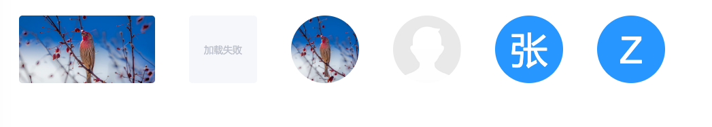

# vue-ele-image | 使 element-ui image 组件更简单、好用

[](https://dream2023.github.io/vue-ele-image/)
[](https://www.npmjs.com/package/vue-ele-image)
[](https://www.npmjs.com/package/vue-ele-image)
[](https://npmcharts.com/compare/vue-ele-image?minimal=true)

## 特点

- 增加 avatar 模式
- 可全局定义配置(lazy, fit)
- 参数更简单(size, radius)
- 保留所有 el-image 的特性



## 在线示例

[https://codepen.io/dream2023/pen/GbKjBa](https://codepen.io/dream2023/pen/GbKjBa)

## 安装

```bash
npm install vue-ele-image --save
```

### 用法

```js
// 全局 (推荐)
import EleImage from 'vue-ele-image'

// 可以配置全局默认值(配置可选)
Vue.use(EleImage, {
  fit: 'cover',
  lazy: true,
  color: '#fff',
  backgroundColor: '#409EFF'
})
```

```js
// 局部导入
// 这里注意要有 {} 括号
import { EleImage } from 'vue-ele-image'

export default {
  components: {
    EleImage
  }
}
```

## 示例

```html
<!-- 普通用法 -->
<ele-image
  :size="100"
  src="https://fuss10.elemecdn.com/e/5d/4a731a90594a4af544c0c25941171jpeg.jpeg"
/>
```

```html
<!-- avatar模式(无src时) -->
<ele-image :size="50" username="zhang" src="" />
```

```html
<!-- 加载失败(同官网一样, 包括其他特性) -->
<el-image>
  <div slot="error" class="image-slot">
    <i class="el-icon-picture-outline"></i>
  </div>
</el-image>
```

## Props 参数

```js
props: {
  username: String, // 当src为false时, avatar模式所显示的字符
  color: String, // avatar模式下, 字体颜色
  backgroundColor: String, // avatar模式下, 背景色
  size: Number, // size相当于 width === height === size
  width: Number, // 如果给定width值, 会覆盖size值
  height: Number, // 如果给定height值, 会覆盖size值
  radius: String, // 圆角, 正常模式默认值 5px, 头像模式: 50%
  src: String, // 同官网
  alt: String, // 同官网
  fit: String, // 同官网
  lazy: Boolean, // 同官网
  referrerPolicy: String, // 同官网
  scrollContainer: [String, Object], // 同官网
}
```

## Events 事件(同官网)

## Slots 插槽(同官网)

## 相关链接

- [element-ui image 组件](https://element.eleme.cn/#/zh-CN/component/image)
- [vue-avatar](https://github.com/eliep/vue-avatar)
